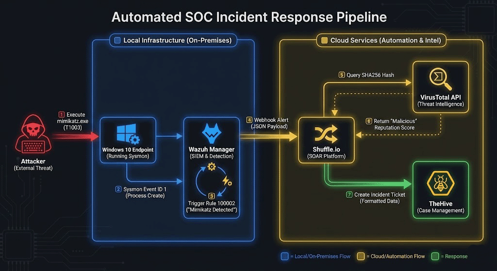
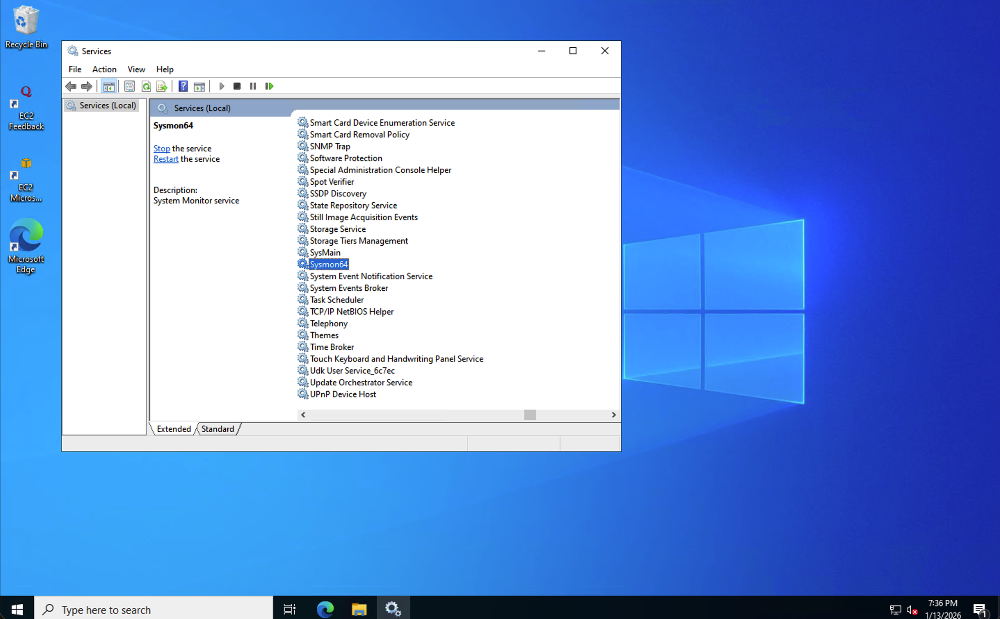
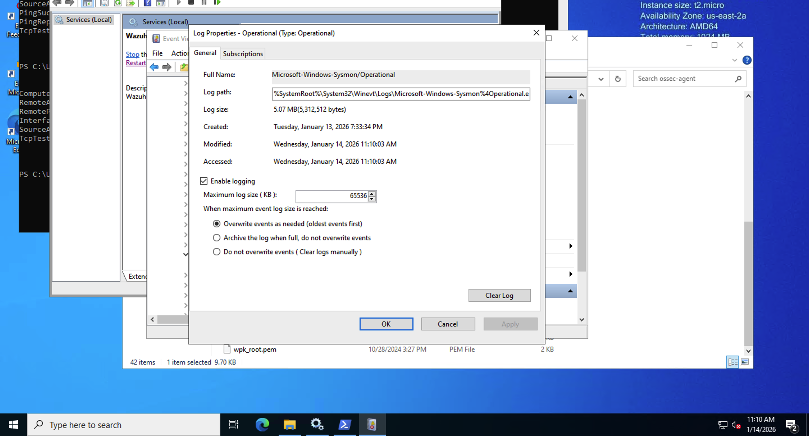
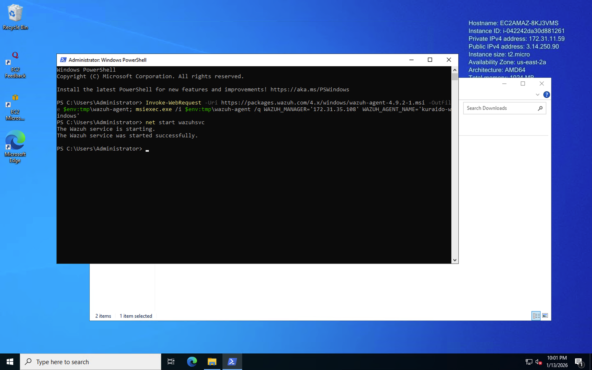
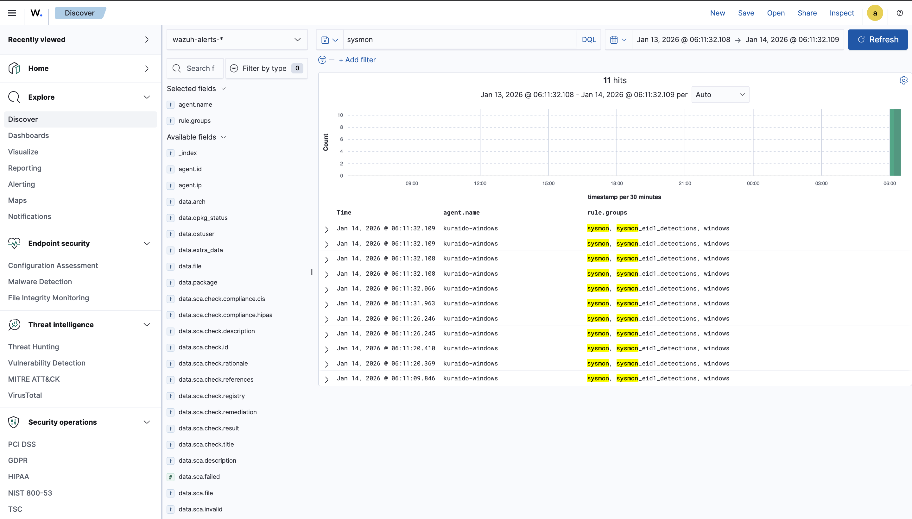
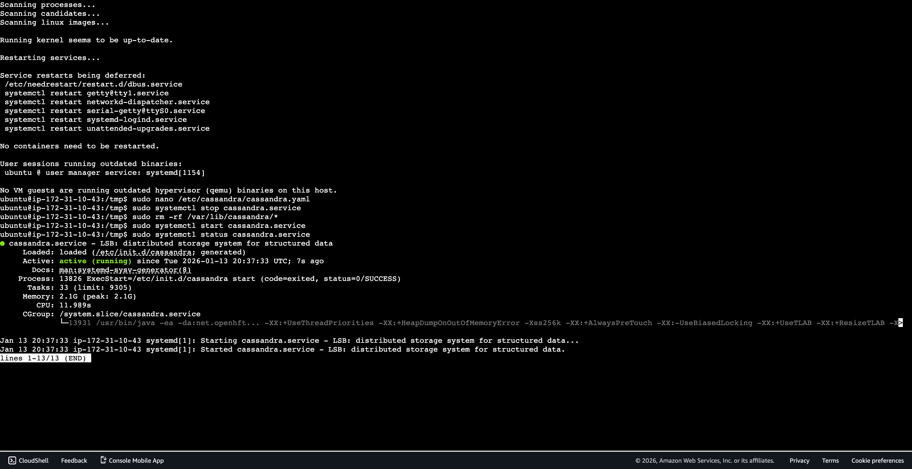
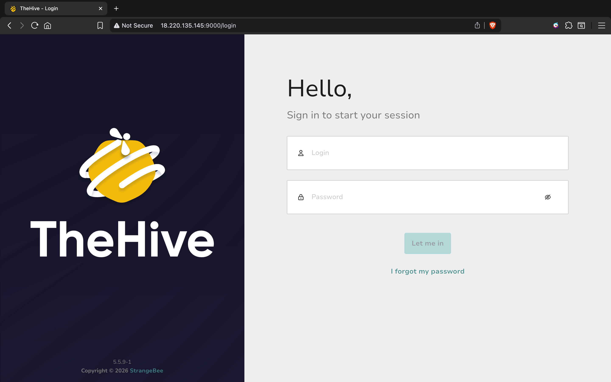

# 🛡️ Capstone Project – Automated SOC Incident Response Pipeline
Automated detection-to-triage SOC pipeline using **Wazuh**, **Shuffle SOAR**, **VirusTotal**, and **TheHive**.  
This project demonstrates end-to-end automation of credential dumping detection (**MITRE ATT&CK T1003**) with real-time enrichment and incident creation, reducing MTTR from ~10 minutes to **<1 second**.

---

## Table of Contents
1. [Lab Overview](#1-lab-overview)
2. [Infrastructure & Architecture](#2-infrastructure--architecture)
3. [Endpoint Monitoring (Sysmon)](#3-endpoint-monitoring-sysmon)
4. [SIEM Deployment (Wazuh)](#4-siem-deployment-wazuh)
5. [Attack Simulation – Mimikatz Execution](#5-attack-simulation--mimikatz-execution)
6. [SOAR Orchestration (Shuffle)](#6-soar-orchestration-shuffle)
7. [Threat Intelligence Enrichment (VirusTotal)](#7-threat-intelligence-enrichment-virustotal)
8. [Incident Management (TheHive)](#8-incident-management-thehive)
9. [Summary & MTTR Metrics](#9-summary--mttr-metrics)

---

## 1. Lab Overview
**Objective:** Design and implement a fully automated SOC Incident Response pipeline that detects credential dumping activity, enriches alerts with threat intelligence, and generates investigation-ready incidents automatically.

**Problem Statement:** Manual endpoint alert triage increases Mean Time To Respond (MTTR) and causes alert fatigue for Tier-1 SOC analysts.

**Solution:** A SOAR-driven workflow that automates detection, enrichment, and incident creation without human intervention.

---

## 2. Infrastructure & Architecture
**Cloud / SaaS Services:**
- Windows 10 Endpoint (Victim)
- Wazuh Manager (Ubuntu 24.04 LTS)
- Shuffle.io (SOAR)
- VirusTotal (Threat Intelligence)
- TheHive (Incident Management)

**Architecture Flow:**

  
---

## 3. Endpoint Monitoring (Sysmon)
**Objective:** Capture detailed Windows process creation events for malicious execution detection.

**Implementation:**
- Installed `Sysmon64` on Windows 10 endpoint
-   
- Applied custom `sysmonconfig.xml`
- Enabled Event ID `1` (Process Creation)

**Verification:**
- Confirmed Sysmon service status via PowerShell
- Validated logs in Windows Event Viewer
- Verified log forwarding to Wazuh

---

## 4. SIEM Deployment (Wazuh)
**Objective:** Centralize endpoint telemetry and detect adversary techniques.

**Implementation:**
- Deployed Wazuh Manager on Ubuntu 24.04
  
  
- Installed Wazuh Agent on Windows endpoint
-   
- Established secure agent-manager communication

**Custom Detection Rule:**
- **Rule ID:** 100002
- **Trigger:** `mimikatz.exe` detected in Sysmon logs
- **Severity Level:** 15

  
  

---

## 5. Attack Simulation – Mimikatz Execution
**Objective:** Simulate a credential dumping attack to validate the pipeline.

**Execution:**
- Executed Mimikatz via PowerShell
- Used filename deception to mimic real attacker behavior

  

**Detection Result:**

- Wazuh detected execution instantly
- Triggered high-severity alert
- Alert forwarded to SOAR automatically

---

## 6. SOAR Orchestration (Shuffle)
**Objective:** Automate alert ingestion, parsing, and enrichment.

**Workflow:**
- Configured Wazuh webhook integration
- Parsed incoming JSON alert payload
- Extracted SHA256 hash of detected binary

**Automation Steps:**
1. Receive Wazuh alert
2. Parse alert fields
3. Extract file hash
4. Enrich IOC
5. Create incident

---

## 7. Threat Intelligence Enrichment (VirusTotal)
**Objective:** Validate detected artifacts using external threat intelligence.

**Integration:**
- VirusTotal API integrated into Shuffle workflow
- Queried extracted SHA256 hash automatically

**Results:**
- API Status: `200 OK`
- File identified as **malicious**
- Reputation data appended to incident

---

## 8. Incident Management (TheHive)
**Objective:** Centralize enriched alerts into investigation-ready cases.

**Deployment:**
- Cassandra   
- Elasticsearch
-   
- TheHive

  

**Automated Case Creation:**
- Shuffle pushed enriched alert data to TheHive
- Included host details, detection rule, hash, and VirusTotal verdict

**Case Status:**
- Status: **New**
- Ready for analyst investigation

---

## 9. Summary & MTTR Metrics
**Key Outcomes:**
- MTTR reduced from ~10 minutes to **<1 second**
- Manual Tier-1 triage eliminated
- Fully automated SOC response pipeline

| Metric | Manual Triage | Automated Pipeline |
| :--- | :--- | :--- |
| **Detection Time** | ~1-2 Minutes | **Instant** |
| **IOC Enrichment** | ~5-10 Minutes | **< 1 Second** |
| **Ticket Creation** | ~3-5 Minutes | **Automated** |
| **Total MTTR** | **~15 Minutes** | **< 2 Seconds** |
